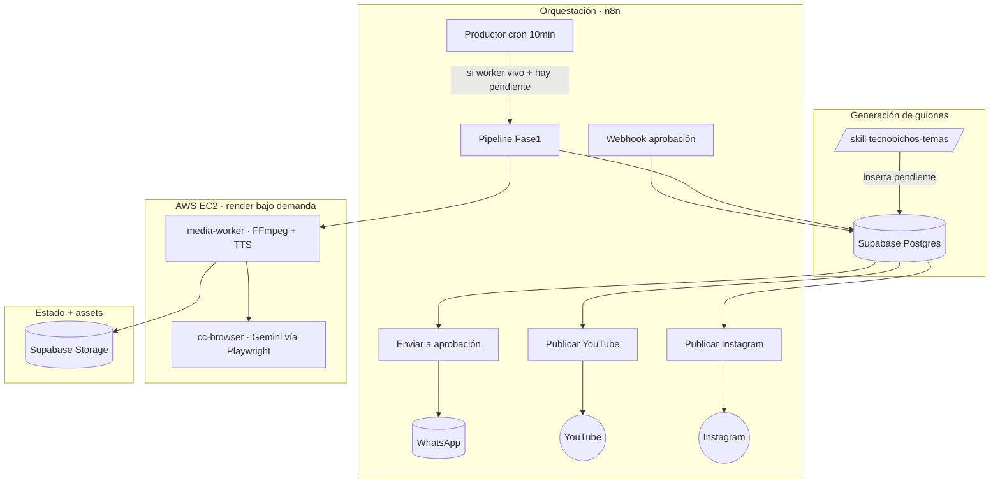

# 🏗️ Arquitectura del sistema

Tecnobichos es un **canal de contenido tech 100% automatizado**: descubre temas,
escribe guiones, produce shorts animados con mascotas, los publica en YouTube e
Instagram y gestiona el estado — con mínima intervención humana (solo aprobar por
WhatsApp).

## Componentes



## Stack

| Capa | Tecnología | Dónde |
|---|---|---|
| Orquestación | **n8n** | VPS Contabo (`n8n.axchisan.com`) |
| Estado + cola | **Supabase Postgres** (`cc_cola_contenido`, `cc_config`, `cc_logs`) | Compartida (Quanta) |
| Almacenamiento | **Supabase Storage** (buckets `cc-videos`, `cc-assets`, `cc-mascota`) | idem |
| Render de video | **media-worker** (FFmpeg + edge-tts/Azure TTS) | AWS EC2 (Coolify) |
| Imágenes IA | **cc-browser** (Gemini web vía Playwright) | AWS EC2 (Coolify) |
| Imagen portada/fallback | Cloudflare Workers AI (Flux) | nube |
| Guiones | skill `tecnobichos-temas` (o Groq de fallback) | — |
| Publicación | YouTube Data API v3 · Instagram Graph API | vía n8n |
| Aprobación/alertas | Evolution API (WhatsApp) + Gmail | VPS |

## Por qué render en AWS y no en el VPS

El VPS tiene RAM ajustada (~3.5 GB libres). Un render de FFmpeg 1080×1920 con
overlays satura la RAM y congela todo. Solución: **media-worker + cc-browser corren
en un EC2** que se enciende **solo cuando hay que renderizar** (EventBridge Scheduler:
arranca Dom/Mié 10pm, apaga Lun/Jue 2am) y se apaga el resto del tiempo para no
gastar. Publicar NO necesita el EC2 (solo n8n + Supabase).

## Máquina de estados

```
pendiente → produciendo → en_revision → en_aprobacion → aprobado → publicado
                                                      ↘ rechazado      (+youtube_url, +instagram_url)
```

Ver el detalle de cada transición en [workflows-n8n.md](workflows-n8n.md).
