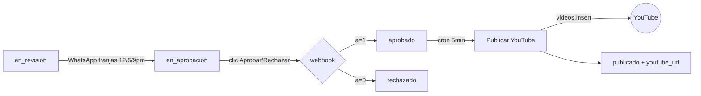

# 📺 Publicación automática en YouTube

> Cómo Tecnobichos sube Shorts a YouTube **sin intervención manual**, usando la
> **YouTube Data API v3** desde n8n. Este documento explica tanto el cableado real
> del workflow como los fundamentos de la API, para que puedas entenderlo o
> replicarlo desde cero.

---

## 1. Visión general del flujo

Un video no se publica apenas se renderiza. Pasa por una **máquina de estados** en
la tabla `cc_cola_contenido` (Supabase Postgres):

```
pendiente → produciendo → en_revision → en_aprobacion → aprobado → publicado
                                                      ↘ rechazado
```

La publicación en YouTube ocurre en el paso **`aprobado → publicado`**. Tres
workflows de n8n colaboran:

| Workflow | Trigger | Qué hace |
|---|---|---|
| **Enviar a aprobación** (`FYJ9eS3ce2MedS2M`) | cron `0 12,17,21 * * *` (12pm/5pm/9pm) | Toma 1 video `en_revision`, lo manda por WhatsApp con botones ✅Aprobar / ❌Rechazar → marca `en_aprobacion`. |
| **Aprobación (webhook)** (`W9bJlOSSovAoLQJE`) | `GET /webhook/cc-approve?id=<uuid>&a=1\|0` | Al tocar el botón, marca `aprobado` (a=1) o `rechazado` (a=0) y responde una página HTML de confirmación. |
| **Publicar YouTube** (`sKCKn6aiYFYWj74J`) | cron cada 5 min | Toma 1 video `aprobado`, lo **sube a YouTube vía API** y marca `publicado` + `youtube_url`. |

Diseño clave: **el humano solo toca un botón de WhatsApp**. Todo lo demás es API.



---

## 2. El workflow "Publicar YouTube" nodo por nodo

Cadena lineal de 9 nodos (`sKCKn6aiYFYWj74J`):

1. **Schedule Trigger** — cron cada 5 minutos.
2. **Buscar aprobado** (HTTP GET a PostgREST):
   ```
   GET https://<supabase>/rest/v1/cc_cola_contenido
       ?estado=eq.aprobado&select=id,titulo,video_url,guion&order=updated_at&limit=1
   Header: Accept: application/vnd.pgrst.object+json
   ```
   > ⚠️ **Gotcha PostgREST:** con el header `pgrst.object`, PostgREST devuelve el
   > objeto, pero n8n a veces lo entrega como **string** bajo `.data`. El nodo
   > siguiente hace `JSON.parse` defensivo.
3. **Parsear datos** (Code node): normaliza el JSON, arma `title`, `description`,
   `tags` a partir de `guion`, y calcula el `topic_id`.
4. **Descargar video** (HTTP GET al `video_url` firmado de Supabase Storage) con
   `responseFormat: file` → deja el binario en la propiedad `data`.
5. **YouTube — Upload** (nodo nativo `n8n-nodes-base.youTube`): **este es el nodo
   que llama a la API** (ver §3).
6. **Marcar publicado** (HTTP PATCH a PostgREST): `estado='publicado'`,
   `youtube_url`, `publicado_en=now()`.
7. **Confirmación WhatsApp** (Evolution API): avisa al dueño que ya está arriba.

Con `errorWorkflow = ZK0RPwJdXyatukam` (Error Handler central → `cc_logs` + WhatsApp)
para que cualquier fallo genere alerta.

---

## 3. El nodo YouTube (lo que realmente llama a la API)

Configuración del nodo `youTube` en modo upload:

| Campo | Valor | Nota |
|---|---|---|
| `resource` | `video` | |
| `operation` | `upload` | Mapea a `videos.insert` de la API. |
| `binaryProperty` | `data` | El binario del paso "Descargar video". |
| `title` | `={{ $json.title }}` | Del guion (máx 100 chars). |
| `description` | `={{ $json.description }}` | Hook + valor + atribución música CC-BY + CTA + hashtags + **nota de contenido generado con IA**. |
| `categoryId` | `28` | *Science & Technology*. |
| `tags` | `={{ $json.tags }}` | Del guion. |
| `privacyStatus` | `public` | | 
| Título incluye | `#Shorts` | Para que YouTube lo trate como Short (vertical <60s). |

> ⚠️ **Gotcha crítico:** el nodo YouTube de n8n devuelve el id del video en
> `uploadId`, **no** en `id`. La URL correcta es:
> ```
> https://youtu.be/{{ $json.uploadId }}
> ```
> Confundirlo es el error #1 al armar este workflow.

**Autoría / credencial:** el nodo usa una credencial de tipo `youTubeOAuth2Api`.
La API de YouTube es OAuth2 puro; ver §4 para el setup.

---

## 4. Fundamentos: la YouTube Data API v3

Si quieres replicar esto **sin n8n** (script propio, otro lenguaje), esto es lo que
hay que saber. El nodo de n8n hace exactamente esto por dentro.

### 4.1 Requisitos previos (Google Cloud)

1. Crear un proyecto en [Google Cloud Console](https://console.cloud.google.com).
2. **Habilitar** la *YouTube Data API v3* (APIs & Services → Library).
3. **Pantalla de consentimiento OAuth** (OAuth consent screen):
   - Tipo *External*, en modo **Testing** basta para uso personal.
   - Agregar tu propio Gmail (el dueño del canal) como **Test user**.
4. **Credenciales → OAuth client ID**, tipo *Web application*:
   - **Authorized redirect URI**: la de tu n8n:
     ```
     https://n8n.axchisan.com/rest/oauth2-credential/callback
     ```
     (Si haces script propio, será tu propio `redirect_uri`, p. ej.
     `http://localhost:8080/callback`.)
   - Guarda el `client_id` y `client_secret`.

### 4.2 El flujo OAuth2 (authorization code)

La API exige actuar **en nombre del canal**, así que se usa OAuth2, no una API key.

```
1. El usuario abre la URL de consentimiento:
   https://accounts.google.com/o/oauth2/v2/auth?
     client_id=<CLIENT_ID>
     &redirect_uri=<REDIRECT_URI>
     &response_type=code
     &scope=https://www.googleapis.com/auth/youtube.upload
     &access_type=offline      ← imprescindible para obtener refresh_token
     &prompt=consent

2. Google redirige a REDIRECT_URI?code=<AUTH_CODE>

3. Intercambiar el code por tokens:
   POST https://oauth2.googleapis.com/token
     code=<AUTH_CODE>
     client_id=<CLIENT_ID>
     client_secret=<CLIENT_SECRET>
     redirect_uri=<REDIRECT_URI>
     grant_type=authorization_code
   → { access_token, refresh_token, expires_in }

4. El access_token dura ~1h. Con el refresh_token renuevas sin volver a pedir consentimiento:
   POST https://oauth2.googleapis.com/token
     client_id, client_secret, refresh_token, grant_type=refresh_token
```

> **En n8n esto es automático:** creas una credencial `youTubeOAuth2Api` con tu
> `client_id`/`client_secret`, pulsas **"Sign in with Google"** una sola vez en la
> UI (esto NO se puede hacer por API), y n8n guarda y refresca el token solo.

**Scope necesario:** `https://www.googleapis.com/auth/youtube.upload` (subir).
Para thumbnails o gestión: `https://www.googleapis.com/auth/youtube`.

### 4.3 Subir el video: `videos.insert` (resumable upload)

El upload real es en **dos pasos** (protocolo resumable de Google):

```
# Paso 1 — iniciar sesión de subida (metadata):
POST https://www.googleapis.com/upload/youtube/v3/videos?uploadType=resumable&part=snippet,status
  Authorization: Bearer <ACCESS_TOKEN>
  Content-Type: application/json
  Body:
  {
    "snippet": {
      "title": "¿Qué es un compilador? #Shorts",
      "description": "…hook + valor + música CC-BY + CTA + hashtags + (contenido generado con IA)…",
      "tags": ["compilador","programacion","tecnobichos"],
      "categoryId": "28"
    },
    "status": {
      "privacyStatus": "public",
      "selfDeclaredMadeForKids": false
    }
  }
  → Respuesta: header  Location: <UPLOAD_URL>   (la sesión resumable)

# Paso 2 — subir los bytes del MP4 a esa UPLOAD_URL:
PUT <UPLOAD_URL>
  Content-Type: video/mp4
  <bytes del archivo>
  → 200 OK { "id": "<VIDEO_ID>", ... }
```

La URL pública final es `https://youtu.be/<VIDEO_ID>` (o
`https://youtube.com/shorts/<VIDEO_ID>`).

### 4.4 Miniatura (opcional): `thumbnails.set`

Requiere **canal verificado** y scope `youtube`:

```
POST https://www.googleapis.com/upload/youtube/v3/thumbnails/set?videoId=<VIDEO_ID>
  Authorization: Bearer <ACCESS_TOKEN>
  Content-Type: image/jpeg
  <bytes del thumbnail 16:9>
```

En Tecnobichos el `media-worker` genera un thumb 16:9 (portada sobre fondo
desenfocado) y un webhook lo sube tras publicar.

### 4.5 Cuota (¡importante!)

La YouTube Data API tiene un presupuesto de **10.000 unidades/día** por proyecto:

| Operación | Costo |
|---|---|
| `videos.insert` (subir) | **~1.600 unidades** |
| `thumbnails.set` | ~50 unidades |
| `search.list` | 100 unidades |

→ **Máximo ~6 subidas/día** con un proyecto. Tecnobichos publica **3/día**, bien
dentro del límite. Si necesitas más, pides ampliación de cuota a Google o usas
varios proyectos.

---

## 5. Metadata: cómo se arma título/descripción

El nodo "Parsear datos" construye la metadata desde el `guion` (JSON generado por la
skill `/tecnobichos-temas` o por el LLM del pipeline):

- **title**: `guion.titulo` + ` #Shorts` (recortado a 100 chars).
- **description**: plantilla rica —
  ```
  <hook>

  <1-2 frases de valor>

  🎵 Música: <atribución CC-BY>
  👉 Síguenos para más tech: @tecnobichos94

  #hashtag1 #hashtag2 … #tecnobichos #Shorts

  — Contenido generado con IA —
  ```
- **tags**: `guion.hashtags` (sin `#`).

La **nota de contenido generado con IA** es obligatoria por políticas de la
plataforma (ver `brief/brief-maestro.md`, §10 Cumplimiento).

---

## 6. Errores comunes y cómo se resolvieron

| Síntoma | Causa | Solución |
|---|---|---|
| URL del video sale `undefined` | el nodo YouTube devuelve `uploadId`, no `id` | usar `{{ $json.uploadId }}` |
| `.data` llega como string y el Code node peta | PostgREST con `pgrst.object` | `JSON.parse` defensivo |
| `quotaExceeded` | >6 subidas/día en el proyecto | espaciar publicaciones (3/día) o ampliar cuota |
| Requiere re-login OAuth cada rato | falta `access_type=offline` / `prompt=consent` | pedir refresh_token en el consentimiento inicial |
| Video sale privado/no-Short | falta `#Shorts` o `privacyStatus` | añadir `#Shorts` al título y `public` |

---

## 7. Referencias

- YouTube Data API v3 — `videos.insert`: https://developers.google.com/youtube/v3/docs/videos/insert
- Resumable uploads: https://developers.google.com/youtube/v3/guides/using_resumable_upload_protocol
- Cuotas: https://developers.google.com/youtube/v3/getting-started#quota
- OAuth2 para apps web: https://developers.google.com/identity/protocols/oauth2/web-server
- n8n YouTube node: https://docs.n8n.io/integrations/builtin/app-nodes/n8n-nodes-base.youtube/

Ver también [publicacion-instagram.md](publicacion-instagram.md) para el flujo hermano de Reels.
